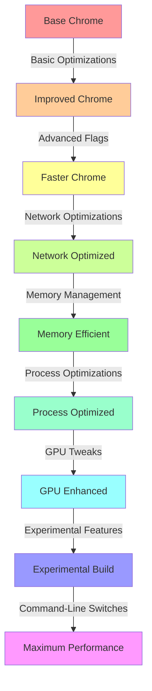

Certainly! I'll provide you with more advanced suggestions and configurations to further optimize Chrome's performance. This guide will delve deeper into Chrome's internal settings and include some more technical optimizations.

# Advanced Chrome Optimization Guide

## Table of Contents

- [Advanced Chrome Optimization Guide](#advanced-chrome-optimization-guide)
  - [Table of Contents](#table-of-contents)
  - [Basic Optimizations](#basic-optimizations)
  - [Advanced Flags Configuration](#advanced-flags-configuration)
  - [Network Optimizations](#network-optimizations)
  - [Memory Management](#memory-management)
  - [Process and Thread Optimizations](#process-and-thread-optimizations)
  - [GPU Acceleration Tweaks](#gpu-acceleration-tweaks)
  - [Experimental Features](#experimental-features)
  - [Command-Line Switches](#command-line-switches)
    - [Performance Impact Chart](#performance-impact-chart)

## Basic Optimizations

First, ensure you've implemented the basic optimizations mentioned in the previous response:

- Disable unnecessary extensions
- Manage tabs efficiently
- Clear browsing data regularly
- Disable JavaScript (if feasible)
- Adjust graphics settings
- Disable preloading
- Use hardware acceleration
- Keep Chrome and your OS updated

## Advanced Flags Configuration

Access `chrome://flags/` and modify the following flags for improved performance:

| Flag | Setting | Description |
|------|---------|-------------|
| Parallel downloading | Enabled | Speeds up file downloads |
| Throttle expensive background timers | Enabled | Reduces CPU usage |
| Heavy Ad Intervention | Enabled | Blocks resource-heavy ads |
| Back-forward cache | Enabled | Improves page loading for navigation |
| Experimental QUIC protocol | Enabled | Can improve connection speeds |
| V8 Sparkplug | Enabled | Improves JavaScript performance |
| TLS 1.3 Hardening for local anchors | Enabled | Enhances security without performance loss |

> 💡 **Tip**: These flags may change with Chrome updates. Always read the descriptions before enabling.

## Network Optimizations

1. **DNS Prefetching**: 
   - Go to `chrome://settings/security`
   - Enable "Use a prediction service to load pages more quickly"

2. **Customize DNS Settings**:
   - Use `chrome://net-internals/#dns` to clear host cache and sockets
   - Consider using a faster DNS service like Google Public DNS or Cloudflare

3. **Reduce Buffer Size**:
   - Add `--disk-cache-size=1` to Chrome's shortcut target to minimize disk caching

## Memory Management

1. **Limit Memory Usage**:
   - Use the command-line switch `--max-old-space-size=X` where X is the maximum memory in MB

2. **Enable Tab Discarding**:
   - Go to `chrome://flags/#automatic-tab-discarding`
   - Enable "Automatic tab discarding"

3. **Use The Great Suspender Extension**:
   - Automatically suspends unused tabs to free up system resources

## Process and Thread Optimizations

1. **Adjust Process Models**:
   - Go to `chrome://flags/#process-per-site`
   - Enable "Strict site isolation" for security, or disable for performance

2. **Renderer Process Limit**:
   - Use `--renderer-process-limit=X` in the command line to limit the number of renderer processes

3. **Thread Tweaks**:
   - Enable `--disable-threaded-scrolling` to reduce thread usage

## GPU Acceleration Tweaks

1. **Force GPU Rasterization**:
   - Enable `--force-gpu-rasterization` in the command line

2. **Adjust Tile Size**:
   - Use `--gpu-rasterization-msaa-sample-count=0` to disable antialiasing for faster rendering

3. **Disable GPU Watchdog**:
   - Add `--disable-gpu-watchdog` to prevent the GPU process from being killed (use cautiously)

## Experimental Features

1. **Enable V8 Lazy Parsing**:
   - Use `--enable-lazy-frame-loading` to defer parsing of non-critical JavaScript

2. **Blink GC Tweaks**:
   - Add `--blink-settings=threadedScrollingEnabled=false` to disable threaded scrolling

3. **Field Trial Testing**:
   - Use `--force-fieldtrials=WebRTC-H264HighProfile/Enabled/` to force H264 high profile in WebRTC

## Command-Line Switches

Create a shortcut to Chrome and add these switches to the target field:

```
"C:\Program Files\Google\Chrome\Application\chrome.exe" --disable-extensions --disable-plugins --disable-software-rasterizer --disable-background-networking --disable-logging --disable-databases --disable-gpu-compositing --disable-3d-apis --disable-bundled-ppapi-flash --disable-default-apps
```

This combination disables many features for maximum performance, but may affect functionality on some websites.

---

### Performance Impact Chart

Here's a hypothetical chart showing the potential impact of these advanced optimizations:



> ⚠️ **Warning**: Some of these advanced optimizations may cause instability or break certain website features. Always test thoroughly and be prepared to revert changes if issues occur.

By implementing these advanced optimizations, you can potentially achieve significant performance improvements in Chrome. However, remember that the actual impact will vary depending on your specific hardware, network conditions, and browsing habits.