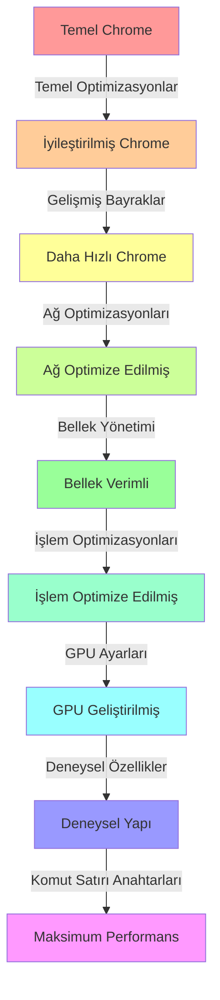

Tabii ki! Chrome'u mümkün olduğunca hızlandırmak için gelişmiş önerileri ve yapılandırmaları içeren kapsamlı bir kılavuzu Türkçe olarak sunacağım.

# Gelişmiş Chrome Optimizasyon Kılavuzu

## İçindekiler

- [Gelişmiş Chrome Optimizasyon Kılavuzu](#gelişmiş-chrome-optimizasyon-kılavuzu)
  - [İçindekiler](#i̇çindekiler)
  - [Temel Optimizasyonlar](#temel-optimizasyonlar)
  - [Gelişmiş Bayrak Yapılandırması](#gelişmiş-bayrak-yapılandırması)
  - [Ağ Optimizasyonları](#ağ-optimizasyonları)
  - [Bellek Yönetimi](#bellek-yönetimi)
  - [İşlem ve İş Parçacığı Optimizasyonları](#i̇şlem-ve-i̇ş-parçacığı-optimizasyonları)
  - [GPU Hızlandırma Ayarları](#gpu-hızlandırma-ayarları)
  - [Deneysel Özellikler](#deneysel-özellikler)
  - [Komut Satırı Anahtarları](#komut-satırı-anahtarları)
    - [Performans Etki Grafiği](#performans-etki-grafiği)

## Temel Optimizasyonlar

Öncelikle, önceki yanıtta belirtilen temel optimizasyonların uygulandığından emin olun:

- Gereksiz uzantıları devre dışı bırakın
- Sekmeleri verimli bir şekilde yönetin
- Tarama verilerini düzenli olarak temizleyin
- JavaScript'i devre dışı bırakın (uygunsa)
- Grafik ayarlarını düzenleyin
- Ön yüklemeyi devre dışı bırakın
- Donanım hızlandırmayı kullanın
- Chrome ve işletim sisteminizi güncel tutun

## Gelişmiş Bayrak Yapılandırması

`chrome://flags/` adresine erişin ve gelişmiş performans için aşağıdaki bayrakları değiştirin:

| Bayrak | Ayar | Açıklama |
|--------|------|----------|
| Parallel downloading | Etkin | Dosya indirmelerini hızlandırır |
| Throttle expensive background timers | Etkin | CPU kullanımını azaltır |
| Heavy Ad Intervention | Etkin | Kaynak yoğun reklamları engeller |
| Back-forward cache | Etkin | Gezinme için sayfa yüklemeyi iyileştirir |
| Experimental QUIC protocol | Etkin | Bağlantı hızlarını iyileştirebilir |
| V8 Sparkplug | Etkin | JavaScript performansını artırır |
| TLS 1.3 Hardening for local anchors | Etkin | Performans kaybı olmadan güvenliği artırır |

> 💡 **İpucu**: Bu bayraklar Chrome güncellemeleriyle değişebilir. Etkinleştirmeden önce her zaman açıklamaları okuyun.

## Ağ Optimizasyonları

1. **DNS Ön Belleğe Alma**: 
   - `chrome://settings/security` adresine gidin
   - "Sayfaları daha hızlı yüklemek için tahmin hizmetini kullan" seçeneğini etkinleştirin

2. **DNS Ayarlarını Özelleştirme**:
   - Ana bilgisayar önbelleğini ve soketleri temizlemek için `chrome://net-internals/#dns` adresini kullanın
   - Google Public DNS veya Cloudflare gibi daha hızlı bir DNS hizmeti kullanmayı düşünün

3. **Arabellek Boyutunu Azaltma**:
   - Disk önbelleğe almayı en aza indirmek için Chrome'un kısayol hedefine `--disk-cache-size=1` ekleyin

## Bellek Yönetimi

1. **Bellek Kullanımını Sınırlama**:
   - Komut satırı anahtarı `--max-old-space-size=X` kullanın; burada X, MB cinsinden maksimum belleği ifade eder

2. **Sekme Atma İşlemini Etkinleştirme**:
   - `chrome://flags/#automatic-tab-discarding` adresine gidin
   - "Otomatik sekme atma" seçeneğini etkinleştirin

3. **The Great Suspender Uzantısını Kullanma**:
   - Kullanılmayan sekmeleri otomatik olarak askıya alarak sistem kaynaklarını serbest bırakır

## İşlem ve İş Parçacığı Optimizasyonları

1. **İşlem Modellerini Ayarlama**:
   - `chrome://flags/#process-per-site` adresine gidin
   - Güvenlik için "Katı site izolasyonu"nu etkinleştirin veya performans için devre dışı bırakın

2. **İşleyici İşlem Sınırı**:
   - İşleyici işlem sayısını sınırlamak için komut satırında `--renderer-process-limit=X` kullanın

3. **İş Parçacığı Ayarları**:
   - İş parçacığı kullanımını azaltmak için `--disable-threaded-scrolling` seçeneğini etkinleştirin

## GPU Hızlandırma Ayarları

1. **GPU Rasterizasyonunu Zorla**:
   - Komut satırında `--force-gpu-rasterization` seçeneğini etkinleştirin

2. **Döşeme Boyutunu Ayarlama**:
   - Daha hızlı işleme için kenar yumuşatmayı devre dışı bırakmak üzere `--gpu-rasterization-msaa-sample-count=0` kullanın

3. **GPU Bekçisini Devre Dışı Bırakma**:
   - GPU işleminin sonlandırılmasını önlemek için `--disable-gpu-watchdog` ekleyin (dikkatli kullanın)

## Deneysel Özellikler

1. **V8 Tembel Ayrıştırmayı Etkinleştirme**:
   - Kritik olmayan JavaScript'in ayrıştırılmasını ertelemek için `--enable-lazy-frame-loading` kullanın

2. **Blink GC Ayarları**:
   - İş parçacıklı kaydırmayı devre dışı bırakmak için `--blink-settings=threadedScrollingEnabled=false` ekleyin

3. **Alan Denemesi Testi**:
   - WebRTC'de H264 yüksek profilini zorlamak için `--force-fieldtrials=WebRTC-H264HighProfile/Enabled/` kullanın

## Komut Satırı Anahtarları

Chrome'a bir kısayol oluşturun ve hedef alanına bu anahtarları ekleyin:

```
"C:\Program Files\Google\Chrome\Application\chrome.exe" --disable-extensions --disable-plugins --disable-software-rasterizer --disable-background-networking --disable-logging --disable-databases --disable-gpu-compositing --disable-3d-apis --disable-bundled-ppapi-flash --disable-default-apps
```

Bu kombinasyon, maksimum performans için birçok özelliği devre dışı bırakır, ancak bazı web sitelerindeki işlevselliği etkileyebilir.

---

### Performans Etki Grafiği

İşte bu gelişmiş optimizasyonların potansiyel etkisini gösteren varsayımsal bir grafik:



> ⚠️ **Uyarı**: Bu gelişmiş optimizasyonların bazıları kararsızlığa neden olabilir veya belirli web sitesi özelliklerini bozabilir. Her zaman kapsamlı test yapın ve sorun oluşursa değişiklikleri geri almaya hazır olun.

Bu gelişmiş optimizasyonları uygulayarak, Chrome'da önemli performans iyileştirmeleri elde edebilirsiniz. Ancak, gerçek etkinin belirli donanımınıza, ağ koşullarınıza ve tarama alışkanlıklarınıza bağlı olarak değişeceğini unutmayın.