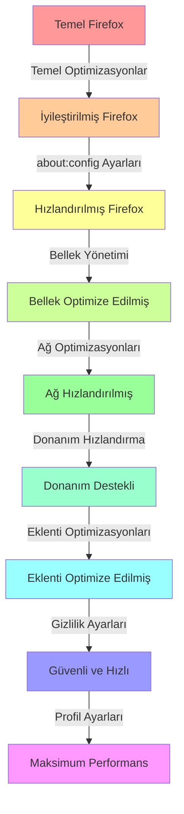

Certainly! I'll provide a comprehensive guide for optimizing Firefox, similar to the one we created for Chrome. This guide will cover both basic and advanced optimizations to make Firefox as fast as possible.

# Firefox Gelişmiş Optimizasyon Kılavuzu

## İçindekiler

- [Firefox Gelişmiş Optimizasyon Kılavuzu](#firefox-gelişmiş-optimizasyon-kılavuzu)
  - [İçindekiler](#i̇çindekiler)
  - [Temel Optimizasyonlar](#temel-optimizasyonlar)
  - [about:config Ayarları](#aboutconfig-ayarları)
  - [Bellek Yönetimi](#bellek-yönetimi)
  - [Ağ Optimizasyonları](#ağ-optimizasyonları)
  - [Donanım Hızlandırma](#donanım-hızlandırma)
  - [Eklenti ve Tema Optimizasyonları](#eklenti-ve-tema-optimizasyonları)
  - [Gizlilik ve Güvenlik Ayarları](#gizlilik-ve-güvenlik-ayarları)
  - [Gelişmiş Kullanıcı Profili Ayarları](#gelişmiş-kullanıcı-profili-ayarları)
    - [Performans İyileştirme Grafiği](#performans-i̇yileştirme-grafiği)

## Temel Optimizasyonlar

1. **Firefox'u Güncelleyin**: En son sürümü kullanın.
2. **Gereksiz Eklentileri Kaldırın**: `about:addons` adresine gidin ve kullanılmayan eklentileri devre dışı bırakın.
3. **Tarama Verilerini Temizleyin**: `Ctrl + Shift + Del` tuşlarına basın ve önbelleği, çerezleri ve geçmişi temizleyin.
4. **Sekme Sayısını Azaltın**: Çok fazla açık sekme performansı düşürür.

## about:config Ayarları

`about:config` adresine giderek aşağıdaki ayarları yapın:

| Ayar | Değer | Açıklama |
|------|-------|----------|
| browser.cache.disk.enable | false | Disk önbelleğini devre dışı bırakır |
| network.http.pipelining | true | HTTP isteklerini hızlandırır |
| network.http.proxy.pipelining | true | Proxy kullanımını iyileştirir |
| network.http.pipelining.maxrequests | 8 | Maksimum eşzamanlı istek sayısını artırır |
| browser.tabs.animate | false | Sekme animasyonlarını devre dışı bırakır |
| layout.css.servo.enabled | true | Yeni CSS motoru Servo'yu etkinleştirir |

> 💡 **İpucu**: Bu ayarları değiştirirken dikkatli olun. Her zaman varsayılan değeri not alın.

## Bellek Yönetimi

1. **Bellek Limiti Ayarlama**:
   - `about:config`'de `browser.cache.memory.capacity` değerini -1 yaparak otomatik yönetimi etkinleştirin.

2. **İçerik İşlem Sınırı**:
   - `dom.ipc.processCount` değerini donanımınıza uygun bir sayıya ayarlayın (örn. 4 veya 8).

3. **Boşta Sekmeleri Boşaltma**:
   - `browser.tabs.unloadOnLowMemory` değerini `true` yapın.

## Ağ Optimizasyonları

1. **DNS Ön Belleğe Alma**:
   - `network.dnsCacheEntries` değerini artırın (örn. 1000).

2. **IPv6 Devre Dışı Bırakma** (gerekirse):
   - `network.dns.disableIPv6` değerini `true` yapın.

3. **Bağlantı Sayısını Artırma**:
   - `network.http.max-connections` değerini artırın (örn. 256).

## Donanım Hızlandırma

1. **WebRender Etkinleştirme**:
   - `gfx.webrender.all` değerini `true` yapın.

2. **GPU Kompozisyonu**:
   - `layers.acceleration.force-enabled` değerini `true` yapın.

3. **Medya Donanım Hızlandırma**:
   - `media.hardware-video-decoding.enabled` değerini `true` yapın.

## Eklenti ve Tema Optimizasyonları

1. **Hafif Temalar Kullanın**: Karmaşık temalar performansı etkileyebilir.
2. **uBlock Origin** gibi hafif reklam engelleyiciler kullanın.
3. **NoScript** ile JavaScript kontrolü sağlayın (dikkatli kullanın).

## Gizlilik ve Güvenlik Ayarları

1. **Takip Koruması**:
   - Ayarlar > Gizlilik ve Güvenlik > Gelişmiş İzleme Koruması'nı "Katı" olarak ayarlayın.

2. **Çerezleri Sınırlama**:
   - `network.cookie.cookieBehavior` değerini 1 (yalnızca ziyaret edilen sitelerden) yapın.

3. **Telemetri Devre Dışı Bırakma**:
   - `toolkit.telemetry.enabled` değerini `false` yapın.

## Gelişmiş Kullanıcı Profili Ayarları

1. **Yeni Profil Oluşturma**:
   - `about:profiles` adresinden yeni bir profil oluşturun.

2. **user.js Dosyası Kullanma**:
   - Profil klasörünüze özelleştirilmiş bir `user.js` dosyası ekleyin.

3. **Önbellek Boyutunu Ayarlama**:
   - `browser.cache.disk.capacity` değerini düşük bir değere ayarlayın (örn. 358400 for 350MB).

---

### Performans İyileştirme Grafiği

> ⚠️ **Uyarı**: Bu gelişmiş ayarların bazıları Firefox'un kararlılığını etkileyebilir veya belirli web sitelerinin işlevselliğini bozabilir. Değişiklikleri dikkatlice uygulayın ve sorun yaşarsanız varsayılan ayarlara dönmeye hazır olun.

Bu optimizasyonları uyguladıktan sonra, Firefox'unuzun performansında önemli bir artış görebilirsiniz. Ancak, gerçek etki donanımınıza, internet bağlantınıza ve tarama alışkanlıklarınıza bağlı olarak değişebilir. Her zaman yedek almayı ve değişiklikleri kademeli olarak uygulamayı unutmayın.