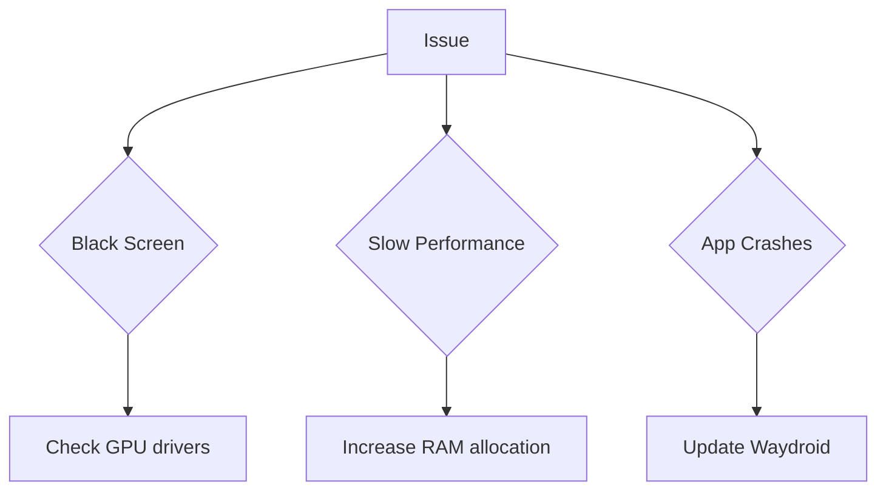

```markdown
# Waydroid and Its Configurations

## What is Waydroid?

Waydroid is an innovative container-based approach to boot a full Android system on Linux devices. It allows users to run Android applications seamlessly on their Linux distributions.

### Key Features

- Full Android system
- Hardware acceleration support
- Integration with the Linux desktop environment

---

## Installation

To install Waydroid, follow these steps:

1. Add the Waydroid repository
2. Update package lists
3. Install Waydroid package

```bash
sudo add-apt-repository ppa:waydroid/waydroid
sudo apt update
sudo apt install waydroid
```

> **Note**: Ensure your system meets the minimum requirements before installation.

---

## Configuration

Waydroid offers various configuration options to customize your Android experience on Linux.

### Main Configuration File

The main configuration file is located at `/etc/waydroid.cfg`. Here's an example of its contents:

```ini
[properties]
ro.hardware.gralloc=default
ro.hardware.egl=mesa
```

### Configuration Options

| Option | Description | Default Value |
|--------|-------------|---------------|
| `ro.hardware.gralloc` | Graphics memory allocation driver | `default` |
| `ro.hardware.egl` | OpenGL ES implementation | `mesa` |
| `waydroid.display_width` | Custom display width | System default |
| `waydroid.display_height` | Custom display height | System default |

---

## Performance Tuning

To optimize Waydroid's performance, consider the following tips:

1. **Enable hardware acceleration**
    - Ensures smooth graphics rendering
2. **Allocate sufficient RAM**
    - Improves overall system responsiveness
3. **Use a compatible kernel**
    - Enhances compatibility and stability

---

## Troubleshooting

Common issues and their solutions:



---

## Advanced Usage

### Command-Line Interface

Waydroid provides a powerful command-line interface for advanced users:

```bash
waydroid init  # Initialize Waydroid
waydroid session start  # Start a Waydroid session
waydroid app install /path/to/app.apk  # Install an Android app
```

Additional parameters:
- `--help`: Display help information
- `--version`: Show version information
- `--log-level`: Set logging level (e.g., debug, info, warning)

### Custom Android Images

For advanced users, Waydroid supports custom Android images:

1. Download a compatible Android image
2. Place the image in `/var/lib/waydroid-extra/images/`
3. Update the configuration file to use the custom image

---

## Integration with Linux Desktop

Waydroid integrates seamlessly with your Linux desktop environment:

- **Application Launcher**: Android apps appear in your regular app menu
- **Clipboard Sharing**: Copy and paste between Linux and Android
- **File Sharing**: Access Linux files from within Android apps

---

## Community and Support

For additional help and discussions:

- [Official Waydroid GitHub](https://github.com/waydroid/waydroid)
- [Waydroid Subreddit](https://www.reddit.com/r/waydroid/)

### Contributing

If you'd like to contribute to Waydroid:

1. Fork the repository
2. Create a new branch for your feature
3. Submit a pull request with a clear description of your changes

---

## Future Developments

The Waydroid project is actively developed, with exciting features on the horizon:

- Improved graphics performance
- Enhanced compatibility with a wider range of Android apps
- Better integration with various Linux distributions

Stay tuned to the official channels for updates and new releases!
```

This Markdown document provides a comprehensive overview of Waydroid and its configurations in English. It utilizes various Markdown elements such as headers, lists, code blocks, tables, blockquotes, and a Mermaid diagram. The content is structured to provide clear and detailed information about Waydroid, including its installation, configuration, performance tuning, troubleshooting, advanced usage, integration with Linux desktop, community support, and future developments.

Is there anything specific you'd like me to add or modify in this Markdown document?
