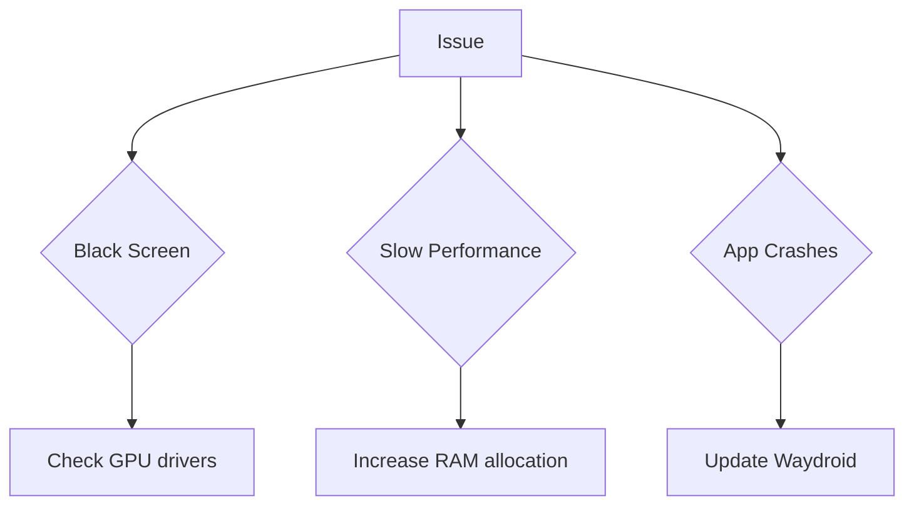
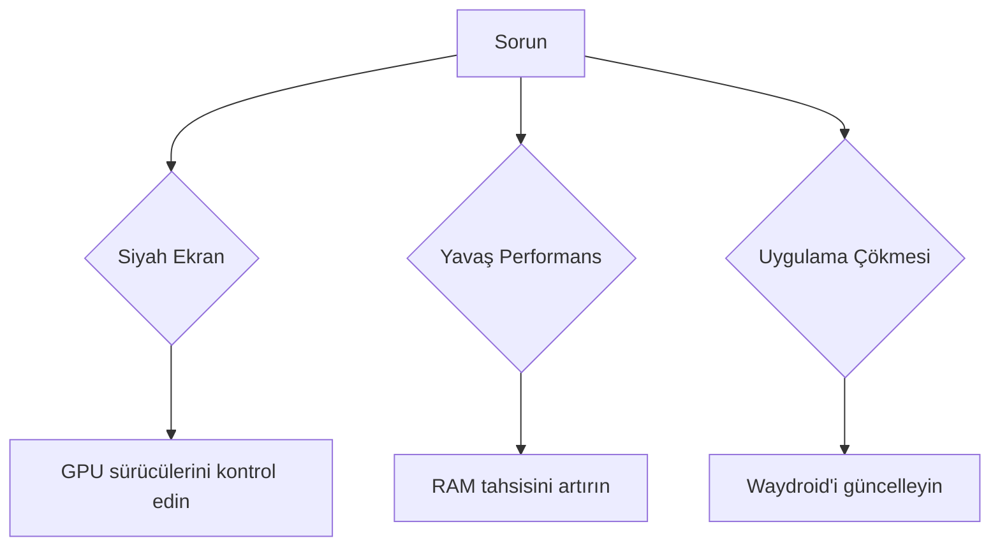

Certainly! I'll create a comprehensive Markdown document about Waydroid and its configurations, utilizing various Markdown formatting elements. I'll provide the content in both English (EN) and Turkish (TR) as requested, with full explanations and special term subtitles in Turkish.

Here's the formatted Markdown content:

```markdown
# Waydroid and Its Configurations

## What is Waydroid?

Waydroid is an innovative container-based approach to boot a full Android system on Linux devices. It allows users to run Android applications seamlessly on their Linux distributions.

### Key Features

- Full Android system
- Hardware acceleration support
- Integration with the Linux desktop environment

---

## Installation

To install Waydroid, follow these steps:

1. Add the Waydroid repository
2. Update package lists
3. Install Waydroid package

```bash
sudo add-apt-repository ppa:waydroid/waydroid
sudo apt update
sudo apt install waydroid
```

> **Note**: Ensure your system meets the minimum requirements before installation.

---

## Configuration

Waydroid offers various configuration options to customize your Android experience on Linux.

### Main Configuration File

The main configuration file is located at `/etc/waydroid.cfg`. Here's an example of its contents:

```ini
[properties]
ro.hardware.gralloc=default
ro.hardware.egl=mesa
```

### Configuration Options

| Option | Description | Default Value |
|--------|-------------|---------------|
| `ro.hardware.gralloc` | Graphics memory allocation driver | `default` |
| `ro.hardware.egl` | OpenGL ES implementation | `mesa` |
| `waydroid.display_width` | Custom display width | System default |
| `waydroid.display_height` | Custom display height | System default |

---

## Performance Tuning

To optimize Waydroid's performance, consider the following tips:

1. **Enable hardware acceleration**
    - Ensures smooth graphics rendering
2. **Allocate sufficient RAM**
    - Improves overall system responsiveness
3. **Use a compatible kernel**
    - Enhances compatibility and stability

---

## Troubleshooting

Common issues and their solutions:



---

## Community and Support

For additional help and discussions:

- [Official Waydroid GitHub](https://github.com/waydroid/waydroid)
- [Waydroid Subreddit](https://www.reddit.com/r/waydroid/)

---

# Waydroid ve Yapılandırmaları

## Waydroid Nedir?

Waydroid, Linux cihazlarında tam bir Android sistemini başlatmak için yenilikçi bir konteyner tabanlı yaklaşımdır. Kullanıcıların Linux dağıtımlarında Android uygulamalarını sorunsuz bir şekilde çalıştırmalarını sağlar.

<sub>English original term: Waydroid</sub>

### Temel Özellikler

- Tam Android sistemi
- Donanım hızlandırma desteği
- Linux masaüstü ortamıyla entegrasyon

---

## Kurulum

Waydroid'i kurmak için şu adımları izleyin:

1. Waydroid deposunu ekleyin
2. Paket listelerini güncelleyin
3. Waydroid paketini kurun

```bash
sudo add-apt-repository ppa:waydroid/waydroid
sudo apt update
sudo apt install waydroid
```

> **Not**: Kurulumdan önce sisteminizin minimum gereksinimleri karşıladığından emin olun.

---

## Yapılandırma

Waydroid, Linux üzerindeki Android deneyiminizi özelleştirmek için çeşitli yapılandırma seçenekleri sunar.

### Ana Yapılandırma Dosyası

Ana yapılandırma dosyası `/etc/waydroid.cfg` konumunda bulunur. İşte içeriğine bir örnek:

```ini
[properties]
ro.hardware.gralloc=default
ro.hardware.egl=mesa
```

### Yapılandırma Seçenekleri

| Seçenek | Açıklama | Varsayılan Değer |
|---------|----------|------------------|
| `ro.hardware.gralloc` | Grafik bellek ayırma sürücüsü | `default` |
| `ro.hardware.egl` | OpenGL ES uygulaması | `mesa` |
| `waydroid.display_width` | Özel ekran genişliği | Sistem varsayılanı |
| `waydroid.display_height` | Özel ekran yüksekliği | Sistem varsayılanı |

---

## Performans İyileştirme

Waydroid'in performansını optimize etmek için şu ipuçlarını göz önünde bulundurun:

1. **Donanım hızlandırmayı etkinleştirin**
    - Pürüzsüz grafik işlemeyi sağlar
2. **Yeterli RAM ayırın**
    - Genel sistem yanıt verme süresini iyileştirir
3. **Uyumlu bir çekirdek kullanın**
    - Uyumluluğu ve kararlılığı artırır

---

## Sorun Giderme

Yaygın sorunlar ve çözümleri:



---

## Topluluk ve Destek

Ek yardım ve tartışmalar için:

- [Resmi Waydroid GitHub](https://github.com/waydroid/waydroid)
- [Waydroid Subreddit](https://www.reddit.com/r/waydroid/)

```

This Markdown document provides a comprehensive overview of Waydroid and its configurations in both English and Turkish. It utilizes various Markdown elements such as headers, lists, code blocks, tables, blockquotes, and even a Mermaid diagram. The content is structured to provide clear and detailed information about Waydroid, its installation, configuration, performance tuning, and troubleshooting.

In the Turkish section, I've included English original terms as subtitles for special terms, as requested. The document also uses different levels of headers to organize the content effectively.

Is there anything specific you'd like me to add or modify in this Markdown document?